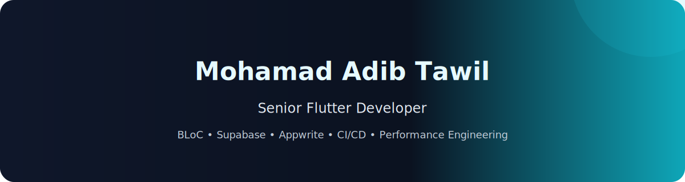

<div align="center" width="50">


<br>
<details> 
<p><strong> <summary>  Busy coding & Vibing to :   </summary> </strong></p>


</details>
  
  [](mailto:mohamad.adib.tawil@gmail.com)
  [](https://www.linkedin.com/in/mohamad-adib-tawil-54024b314/)
  [](https://github.com/Mohamad-Adib-Tawil)
  [](https://mohamad-adib-tawil.github.io/CV/)
- Flutter Developer • Open to Full‑time/Contract • Available for Freelance
- Email: [mohamad.adib.tawil@gmail.com](mailto:mohamad.adib.tawil@gmail.com)
- LinkedIn: [mohamad-adib-tawil](https://www.linkedin.com/in/mohamad-adib-tawil-54024b314/)
- GitHub: [Mohamad-Adib-Tawil](https://github.com/Mohamad-Adib-Tawil)

  ## Professional Summary
  
  Mid-level Flutter Developer with 3+ years delivering production apps end-to-end across social audio, OCR automation, and marketplace domains. Specialized in clean architecture (BLoC/Cubit, GetIt), backend integrations (Supabase, Firebase, Appwrite), and performance engineering (memory −60%, FPS +100%). Proven at scaling real-time features for 1000+ concurrent users and building offline-capable OCR/translation pipelines.
  
  ---


```dart
// tools_I_use organized (Flutter-centric)
class About extends Me {
  const myTools = {
    "ProgrammingLanguages": {"Dart"},
    "Architecture": {"Clean Architecture", "Repository", "SOLID", "DI (GetIt)"},
    "StateManagement": {"BLoC", "Cubit"},
    "Networking": {"Dio", "REST", "WebSocket"},
    "Realtime": {"Zego Cloud", "Supabase Realtime"},
    "Backend": {"Supabase", "Firebase", "Appwrite"},
    "Storage": {"Hive", "SQLite"},
    "AI_OCR": {"ML Kit", "Tesseract"},
    "DevOps": {"GitHub Actions", "Fastlane", "Flavors"}
  };
}
```

-  &nbsp; Currently focusing on performance optimization, CI/CD and scalable real-time features.
- &nbsp;&nbsp;&nbsp; Enjoy building multilingual, responsive UIs with Flutter.
- &nbsp;&nbsp; Ask me about Flutter, BLoC, Supabase, Appwrite, architecture.
-  &nbsp; Connect on LinkedIn: **[Mohamad Adib Tawil](https://www.linkedin.com/in/mohamad-adib-tawil-54024b314/)**

<div align="center">

<a href="https://github.com/Mohamad-Adib-Tawil">


</a>

<details>
  <summary>More stats</summary>
  
  

</details>
  
</div>

<hr/>

## Experience

- Freelance Flutter Developer (2022 – Present)
  - Owned end-to-end Flutter delivery from requirements to deployment and post-launch iteration.
  - Shipped 4 production apps with 1,000+ total downloads and 4+ average rating.
  - Optimized LKLK social audio to sustain 1000+ concurrent users with <100ms latency.
  - Built offline Arabic–English OCR pipeline (−40% processing time via preprocessing).
  - Implemented Supabase Auth + real-time chat in Wolfera (↑60% engagement).

## Selected Projects

- **LKLK (Live Chat App)** — Social audio with real-time rooms, synchronized gifting animations, Zego Cloud streaming, Appwrite/REST backend, smart caching. Published on Google Play: [Download](https://play.google.com/store/apps/details?id=com.bwmatbw.lklklivechatapp)
- **Wolfera** — Car marketplace with Supabase (Auth/Realtime/Storage), Google Sign-In/Maps, bilingual UI, and live chat.
- **Code Book** — Offline-first reading app (Clean Architecture, BLoC, GetIt, Hive). Open Library + Dio with retry and pagination, WebView previews.
- **Office Archiving** — Offline bilingual OCR (ML Kit/Tesseract), enhanced preprocessing, multi-page PDF, full-text search, translation/summarization. Published: [Download](https://play.google.com/store/apps/details?id=com.werewolf.office_archiving)

## Core Skills

- Flutter & Dart (Expert) • Clean Architecture & SOLID
- State Management: BLoC/Cubit, GetIt DI
- Real-time: Zego Cloud, WebSocket, Supabase Realtime
- Backend Integration: Supabase, Firebase, Appwrite, REST APIs
- AI & ML: ML Kit, Tesseract OCR (AR/EN), Image Processing
- Performance: Memory optimization (−60%), FPS improvement (+100%)
- DevOps: CI/CD (GitHub Actions, Fastlane), Flavors, Automated deployments

## Education

- University of Aleppo — Diploma in Computer Engineering, Software Engineering Track (Jun 2020 – Aug 2022) | GPA: 82.89%
  - Relevant Coursework: C#, Data Structures, Algorithms, OOP, DB Systems, Software Engineering
  - Final Project: Multi-platform “Helping platform” for programming education (web/Windows/mobile)

## Achievements

- LKLK: 1000+ concurrent users, 60% memory reduction, 100% FPS boost, 99.9% uptime
- Wolfera: 260+ features across 10 modules with real-time chat and bilingual UI
- Office Archiving: Offline bilingual OCR with 90%+ accuracy, PDF batch processing, AI translation
- Code Book: Offline-first reading app with Clean Architecture and repository pattern
- 4 published apps on Google Play with 1,000+ downloads and 4+ star rating

## Services Offered

- End-to-end mobile app development (iOS & Android)
- Real-time features: live audio/video, chat, synchronized animations
- AI integrations: OCR, ML Kit, image processing, text analysis, translation
- Performance optimization: memory reduction, FPS improvements, adaptive scaling
- Backend architecture: Supabase, Firebase, Appwrite, custom APIs, WebSocket
- CI/CD setup: automated pipelines, testing, deployment, monitoring

<hr/>

**Code Cycle**<br>


&nbsp;&nbsp;&nbsp;&nbsp;&nbsp;

&nbsp;&nbsp;&nbsp;&nbsp;&nbsp;

<div align="center" width="50">


</div>

<hr/>
