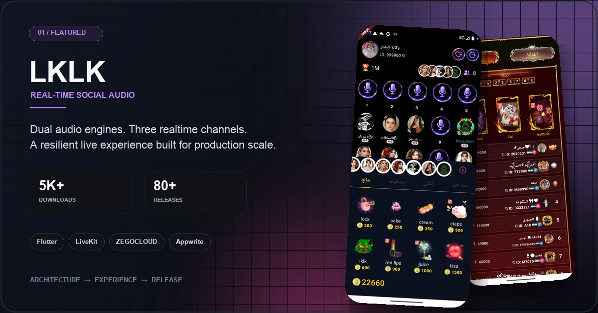
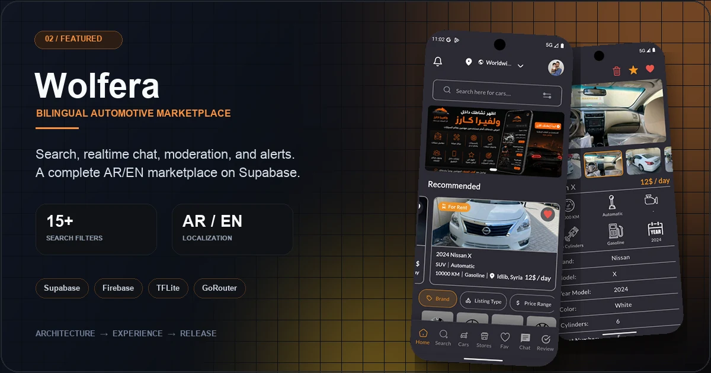
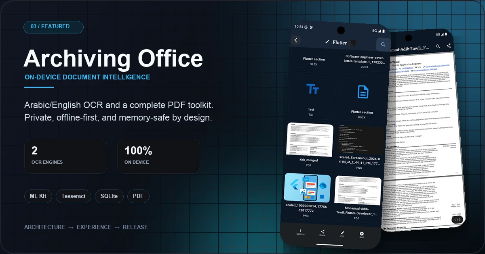
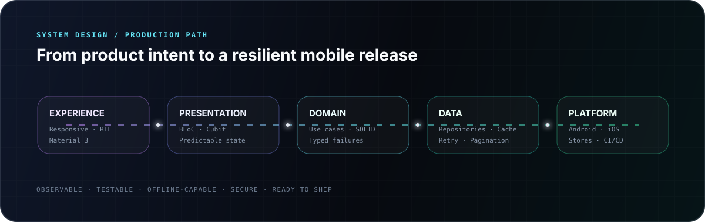
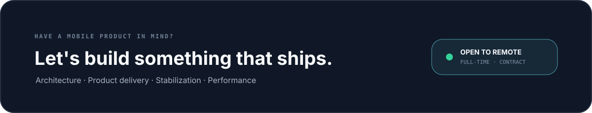

  

  
  
  
  

  
  
  

 

<table>
  <tr>
    <td width="66%" valign="middle">
      <h2>Product-minded engineering. Production-grade execution.</h2>
      
I am a Flutter developer with <strong>4 years of experience</strong> owning mobile products from requirements and architecture through backend integration, performance tuning, and store release.

      
My work spans real-time social audio, bilingual marketplaces, offline document intelligence, and content platforms. I specialize in systems that remain predictable under pressure: feature-based Clean Architecture, BLoC/Cubit, typed failures, resilient realtime channels, and offline-first data flows.

      
<strong>Based in Syria · Working remotely worldwide</strong>

    </td>
    <td width="34%" align="center" valign="middle">
      
    </td>
  </tr>
</table>

  
  
  

---

## 01 / Selected work

REAL PRODUCTS · REAL USERS · MEASURABLE ENGINEERING

  
<strong>Open engineering case study — LKLK</strong>

   
  <table>
    <tr>
      <td width="33%" valign="top"><strong>System</strong>  Architected live rooms for up to 500 listeners and 20 mic seats, with independent reconnect and exponential backoff per realtime channel.</td>
      <td width="33%" valign="top"><strong>Architecture</strong>  Placed ZEGOCLOUD and LiveKit behind an <code>AudioRepository</code>, making SDK switchover a dependency-injection change instead of a rewrite.</td>
      <td width="33%" valign="top"><strong>Product</strong>  Built six IAP coin tiers, VIP progression, and an SVGA/VAP gift queue capped at eight concurrent animations.</td>
    </tr>
  </table>
  
<code>Flutter</code> · <code>Cubit</code> · <code>GetIt</code> · <code>ZEGOCLOUD</code> · <code>LiveKit</code> · <code>ZIM</code> · <code>Appwrite</code> · <code>Hive</code>

  
<a href="https://play.google.com/store/apps/details?id=com.bwmatbw.lklklivechatapp"><strong>View on Google Play →</strong></a>

 

<table>
  <tr>
    <td width="50%" valign="top">
      
      <h3>Wolfera</h3>
      
AR/EN automotive marketplace with Supabase RLS, email/Google/Apple authentication, realtime buyer–seller chat, TFLite moderation, and targeted FCM price alerts.

      
<a href="https://play.google.com/store/apps/details?id=com.wolfera.wolfera"><strong>Google Play →</strong></a>

    </td>
    <td width="50%" valign="top">
      
      <h3>Archiving Office</h3>
      
Private on-device document manager with dual-engine Arabic/English OCR, orientation and preprocessing candidates, PDF editing, and SQLite full-text search.

      
<a href="https://play.google.com/store/apps/details?id=com.werewolf.office_archiving"><strong>Google Play →</strong></a>

    </td>
  </tr>
</table>

  
<strong>Compare the engineering decisions behind Wolfera and Archiving Office</strong>

   
  <table>
    <tr>
      <th>Decision</th>
      <th>Wolfera</th>
      <th>Archiving Office</th>
    </tr>
    <tr>
      <td><strong>Data boundary</strong></td>
      <td>Supabase PostgreSQL with Row-Level Security</td>
      <td>Fully on-device SQLite with additive-only migrations</td>
    </tr>
    <tr>
      <td><strong>Realtime / ML</strong></td>
      <td>Realtime chat, FCM diff-based alerts, TFLite moderation</td>
      <td>ML Kit + Tesseract candidate scoring and local processing</td>
    </tr>
    <tr>
      <td><strong>Resilience</strong></td>
      <td>Pagination, infinite scroll, secure auth flows</td>
      <td>Page/DPI/size caps and streamed rasterization</td>
    </tr>
  </table>

 

  
  

---

## 02 / Engineering system

THE SAME DISCIPLINE FROM UI TO RELEASE

<table>
  <tr>
    <td width="25%" valign="top"><strong>Realtime</strong>  WebSockets, ZIM, LiveKit, ZEGOCLOUD, Supabase Realtime, reconnect policies.</td>
    <td width="25%" valign="top"><strong>Offline-first</strong>  Hive, SQLite, stale-while-revalidate, pagination, typed cache boundaries.</td>
    <td width="25%" valign="top"><strong>On-device ML</strong>  ML Kit, Tesseract, TFLite, image preprocessing, candidate scoring.</td>
    <td width="25%" valign="top"><strong>Release quality</strong>  Flavors, ProGuard/R8, secure storage, Crashlytics, Play Store, App Store.</td>
  </tr>
</table>

---

## 03 / Technical toolkit

  

  
  
  
  
  
  

  
<strong>Open the complete technology map</strong>

   
  <table>
    <tr><td><strong>Architecture & state</strong></td><td>Clean Architecture · SOLID · MVVM · feature modules · BLoC · Cubit · Provider · GetIt · Injectable · Freezed · dartz/Either</td></tr>
    <tr><td><strong>Backend & APIs</strong></td><td>REST · Dio interceptors · retry/backoff · WebSockets · Supabase Auth/Realtime/Storage/RLS · Firebase · Appwrite</td></tr>
    <tr><td><strong>Realtime & media</strong></td><td>ZEGOCLOUD · LiveKit · ZIM · just_audio · audio_session · SVGA/VAP · background_downloader</td></tr>
    <tr><td><strong>Offline & intelligence</strong></td><td>Hive · SQLite · secure storage · ML Kit · Tesseract · TFLite · PDF generation/editing · full-text search</td></tr>
    <tr><td><strong>Release & quality</strong></td><td>Flavors · ProGuard/R8 · Crashlytics · secure environments · isolates · background tasks · IAP · Google Play · App Store</td></tr>
  </table>

---

## 04 / Experience

<table>
  <tr>
    <td width="28%" valign="top">JUL 2022 — PRESENT  <strong>Flutter Developer</strong> Freelance & Contract · Remote</td>
    <td width="72%" valign="top">Designed and shipped 5+ production applications across social audio, marketplaces, document management, and content products—owning architecture, state, backend integration, performance, and release.</td>
  </tr>
  <tr>
    <td width="28%" valign="top">2022  <strong>Android Developer</strong> University & Independent</td>
    <td width="72%" valign="top">Built programming-education products with curated learning tracks, an in-app code console, runnable samples, and auto-graded quizzes.</td>
  </tr>
  <tr>
    <td width="28%" valign="top">2020 — 2022  <strong>Computer Engineering</strong> University of Aleppo</td>
    <td width="72%" valign="top">Software Engineering track · GPA <strong>82.89%</strong> · Data Structures, Algorithms, OOP, Databases, and Software Engineering.</td>
  </tr>
</table>

### GitHub signal

  

  
<strong>Open repository and language statistics</strong>

   
  

    
    
  

 

  <a href="mailto:mohamad.adib.tawil@gmail.com"><strong>Start a conversation</strong></a>
  &nbsp;·&nbsp;
  <a href="https://www.linkedin.com/in/mohamad-adib-tawil-54024b314/"><strong>Connect on LinkedIn</strong></a>

Designed as a living engineering portfolio · Built with Markdown, SVG, and real product work

