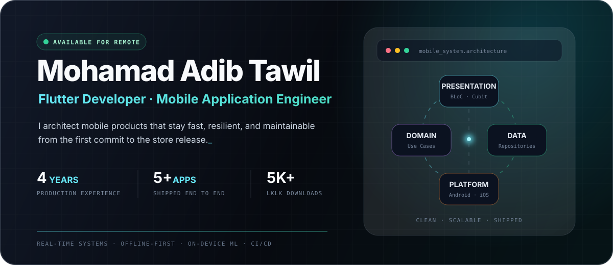

<div align="center">
  
  <br />
  <br />
  <a href="mailto:mohamad.adib.tawil@gmail.com"></a>
  <a href="https://www.linkedin.com/in/mohamad-adib-tawil-54024b314/"></a>
  <a href="https://github.com/Mohamad-Adib-Tawil"></a>
  <p><strong>Flutter Developer · Mobile Application Engineer</strong></p>
  <p>Open to full-time, contract, and selected freelance opportunities.</p>
</div>

---

### Engineering mobile products from architecture to store release

I am a Flutter developer with **4 years of experience** designing, building, and shipping production applications for Android and iOS. My work spans real-time social audio, bilingual marketplaces, offline document intelligence, and content platforms—including a live audio product that surpassed **5,000 downloads**.

I focus on systems that stay maintainable after launch: feature-based Clean Architecture, predictable BLoC/Cubit state, typed failures, resilient networking, offline-first data flows, performance tuning, and secure release pipelines.

<table>
  <tr>
    <td width="50%" valign="top">
      <h3>◈ Product Engineering</h3>
      Requirements, architecture, responsive UI, backend integration, performance, and release ownership across the full mobile lifecycle.
    </td>
    <td width="50%" valign="top">
      <h3>◈ Real-time Systems</h3>
      Live audio, chat, virtual gifts, reconnect strategies, WebSockets, ZEGOCLOUD, LiveKit, ZIM, and Supabase Realtime.
    </td>
  </tr>
  <tr>
    <td width="50%" valign="top">
      <h3>◈ Offline Intelligence</h3>
      Arabic/English OCR, on-device ML, PDF workflows, SQLite search, caching, pagination, and background processing.
    </td>
    <td width="50%" valign="top">
      <h3>◈ Production Quality</h3>
      Flavors, secure configuration, Crashlytics, ProGuard/R8, code generation, app-store delivery, and post-launch iteration.
    </td>
  </tr>
</table>

### Selected work

<table>
  <tr>
    <td width="50%" valign="top">
      <h3>LKLK</h3>
      <p><strong>Real-time social audio · Production</strong></p>
      <p>Architected for up to 500 listeners and 20 mic seats per room. Integrated ZEGOCLOUD and LiveKit behind a repository boundary, plus independent Appwrite, WebSocket, and ZIM real-time channels.</p>
      <p><code>Flutter</code> <code>Cubit</code> <code>GetIt</code> <code>ZEGOCLOUD</code> <code>LiveKit</code> <code>Appwrite</code></p>
      <a href="https://play.google.com/store/apps/details?id=com.bwmatbw.lklklivechatapp">View on Google Play →</a>
    </td>
    <td width="50%" valign="top">
      <h3>Wolfera</h3>
      <p><strong>Bilingual car marketplace · Android + iOS</strong></p>
      <p>Built AR/EN marketplace flows with Supabase RLS, multi-provider authentication, real-time buyer–seller chat, 15+ search filters, TFLite moderation, and targeted FCM alerts.</p>
      <p><code>Flutter</code> <code>Supabase</code> <code>Firebase</code> <code>GoRouter</code> <code>Freezed</code> <code>TFLite</code></p>
      <a href="https://play.google.com/store/apps/details?id=com.wolfera.wolfera">View on Google Play →</a>
    </td>
  </tr>
  <tr>
    <td width="50%" valign="top">
      <h3>Quran Ahmed Karasi</h3>
      <p><strong>Offline Quran reader and audio · Android + iOS</strong></p>
      <p>Designed an explicit eight-phase audio state machine with audio focus, speed, repeat, sleep timer, secure URL validation, and targeted rebuild control for smooth playback UI.</p>
      <p><code>Flutter</code> <code>Cubit</code> <code>just_audio</code> <code>audio_session</code> <code>background_downloader</code></p>
      <a href="https://apps.apple.com/app/id6759857104">App Store →</a> · <a href="https://play.google.com/store/apps/details?id=com.ahmadkarasi.quran">Google Play →</a>
    </td>
    <td width="50%" valign="top">
      <h3>Archiving Office</h3>
      <p><strong>On-device document scanning and OCR · Production</strong></p>
      <p>Created a dual-engine Arabic/English OCR pipeline and full PDF toolkit with memory-safe processing, full-text SQLite search, and additive-only database migrations.</p>
      <p><code>Flutter</code> <code>ML Kit</code> <code>Tesseract</code> <code>SQLite</code> <code>PDF</code> <code>Isolates</code></p>
      <a href="https://play.google.com/store/apps/details?id=com.werewolf.office_archiving">View on Google Play →</a>
    </td>
  </tr>
</table>

<details>
  <summary><strong>More work — Book Code</strong></summary>
  <br />
  <p>An offline-first digital library built as a Clean Architecture reference: isolated Hive caches, typed failures with dartz, retry with exponential backoff, debounced search, infinite scroll, and HTTPS enforcement in the in-app reader.</p>
  <p><code>Flutter</code> <code>BLoC</code> <code>Dio</code> <code>Hive</code> <code>GetIt</code> <code>GoRouter</code> <code>dartz</code></p>
</details>

### Technical stack

<div align="center">


</div>

```dart
const engineeringFocus = {
  'architecture': ['Clean Architecture', 'SOLID', 'feature-based modules'],
  'state': ['BLoC', 'Cubit', 'Freezed'],
  'data': ['REST', 'Dio', 'WebSockets', 'offline-first caching'],
  'platforms': ['Android', 'iOS', 'Arabic RTL', 'English'],
  'delivery': ['Flavors', 'CI/CD', 'Google Play', 'App Store'],
};
```

### Experience and foundation

- **Flutter Developer — Freelance & Contract** · July 2022–Present<br />
  Delivered 5+ production applications across social audio, marketplace, document management, and content domains.

- **Android Developer — University & Independent Projects** · 2022<br />
  Built programming-education experiences with curated tracks, runnable code, and auto-graded quizzes.

- **Diploma in Computer Engineering — University of Aleppo** · 2020–2022<br />
  Software Engineering track · GPA **82.89%**.

### GitHub activity

<div align="center">
  
  
</div>

---

<div align="center">
  <p><strong>Have a mobile product that needs to be built, stabilized, or scaled?</strong></p>
  <p><a href="mailto:mohamad.adib.tawil@gmail.com">Start a conversation</a> · <a href="https://www.linkedin.com/in/mohamad-adib-tawil-54024b314/">Connect on LinkedIn</a></p>
  <sub>Syria · Available for remote collaboration</sub>
</div>
